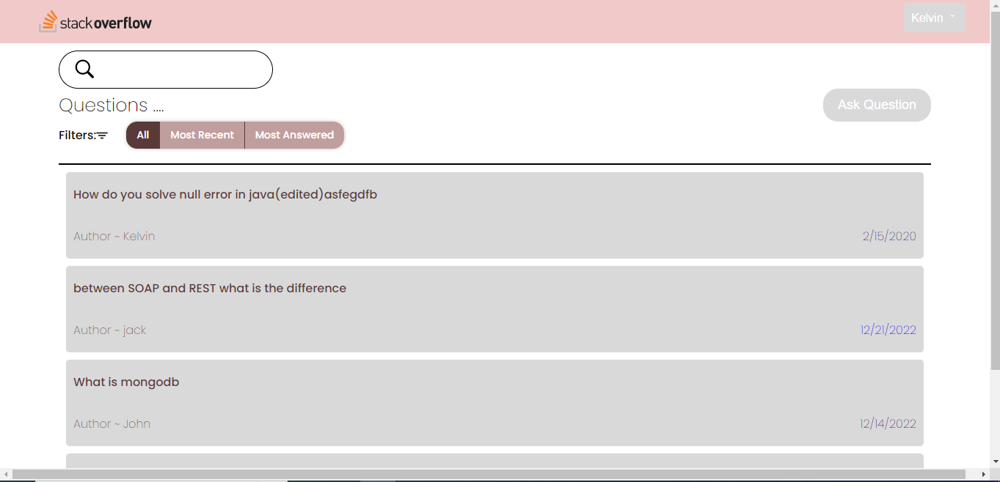
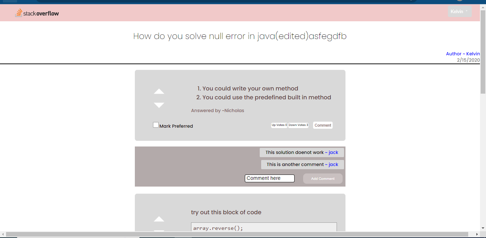
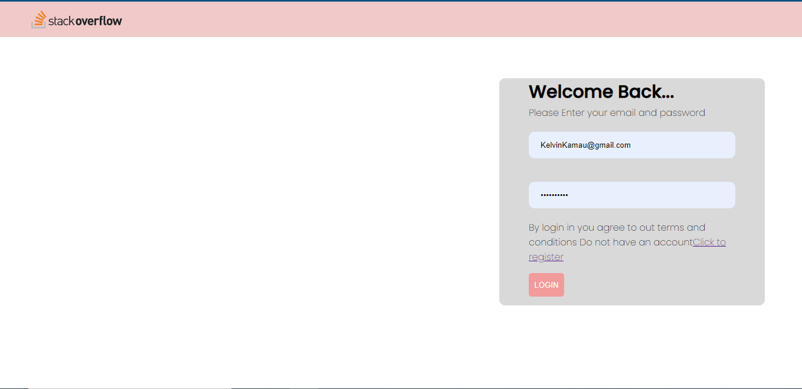
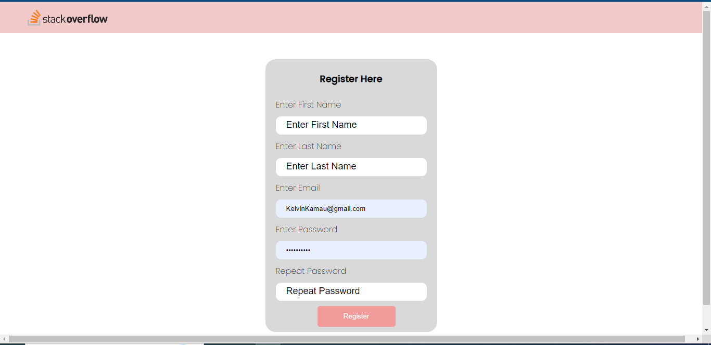

# Stack Over flow lite
- This is a fullstack application for stackoverflow lite 
----
**Version1.0.0**

---

---

## Authors
- Nicholas Barkote <barkotenicholas@gmail.com>
---

## Screenshots

  

  

  

  

## Requirements
- ubuntu or any os with jdk
- IntelliJ

# Tech Stack

- react
- nodejs
## Contact Information

<a href="mailto:barkotenicholas@gmail.com">barkotenicholas@gmail.com</a>

## License & copyright

© Nicholas k Barkote , Moringa school student

Licensed under the [MIT License](LICENSE)